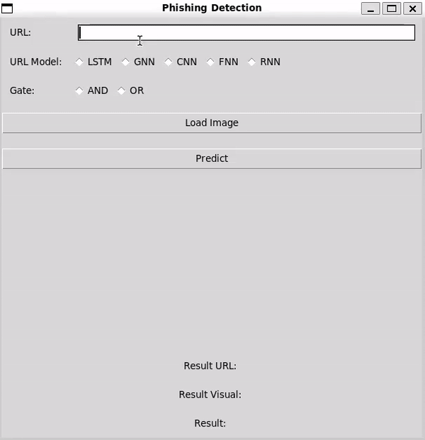
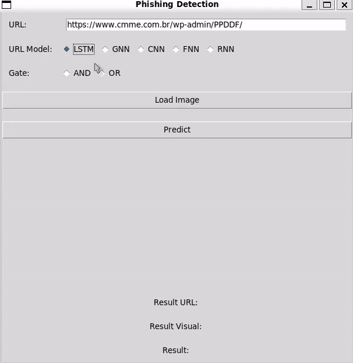
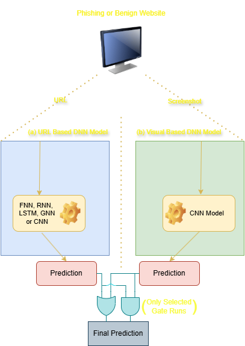

# Text (URL) and Visual (Screenshot) Based Phishing Detection App 

## Requirements

```Powershell
pip install -r .\requirements.txt
```

## Usage
Start the app with:
```Powershell
python .\app.py
```

(I couldn't upload the visual CNN model because of the Github's 100MB limit, I'll try to find workarrounds to upload later.)

Then enter the suspected site's URL into the given input box, select the path to the image (the image must only contain the website content, not the browser) after pressing the 'Load Image' button. 
The app will print results on the screen after the 'Predict' button is selected.

<div style="display: flex; justify-content: space-around; text-align: center;">
    <figure style="width: 45%;">
        
        <figcaption>Usage with Legitimate Site</figcaption>
    </figure>
    <figure style="width: 45%;">
        
        <figcaption>Usage with Phishing Site</figcaption>
    </figure>
</div>

## How it works
The app contains 6 different phishing detection models, 5 of them (LSTM, RNN, GNN, FNN, CNN) predicts based on the textual identity (URL), and 1 of them (CNN) predicts based on the visual identity (Screenshot).

The gate selection fuses textual and visual identity predictions together and outputs a final prediction on the suspected site.



## TODO 
- The app is only a prototype to showcase the models, a Chromium extension is on the roadmap.
- The performance of text-based models should be optimized. (The performance of text-based models is mediocre and was collected from a project that aimed to compare different deep learning algorithms under the same circumstances.)
- Lower the visual CNN model size.